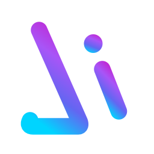
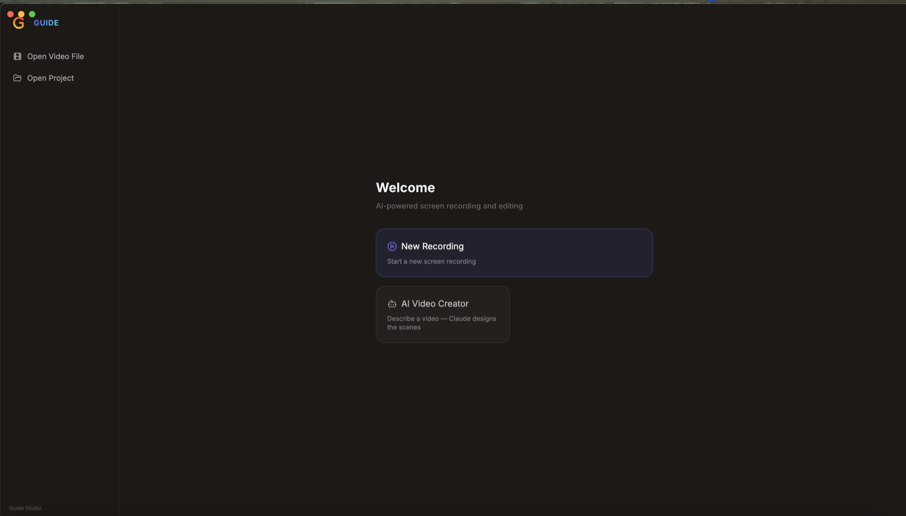
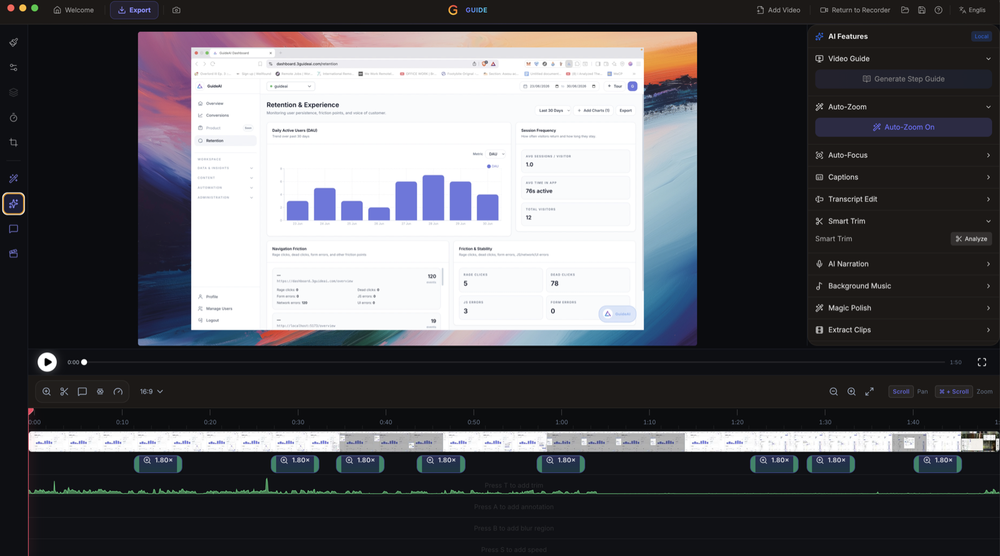
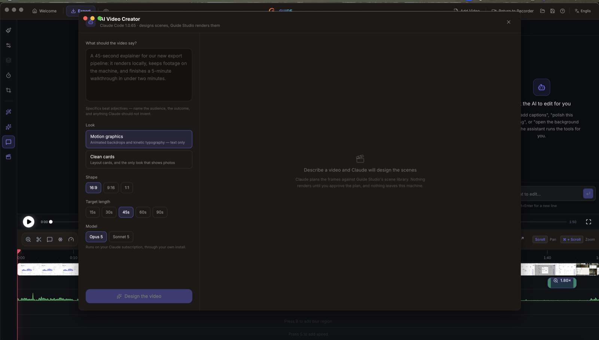

> [!NOTE]
> Actively developed, but not production grade — expect rough edges and bugs. Issues and pull requests are welcome.


<p align="center">
  
  <br />
  <br />
</p>

# <p align="center">Guide Studio</p>

<p align="center"><strong>Record your screen, polish it in the editor, and let AI do the tedious parts — all on your own machine.</strong></p>

Guide Studio is a free, open-source screen recorder and video editor for product demos, walkthroughs, and tutorials. Record a window or your whole screen, then shape the result with zooms, backgrounds, cursor effects, captions, and annotations — and hand the repetitive work to a set of AI tools that run locally.

**100% free** for both **personal** and **commercial** use. Use it, modify it, distribute it. Please respect the License.

> [!NOTE]
> Software should be accessible. Guide Studio has no paid tiers, premium features, upsells, or functionality locked behind a paywall.

<p align="center">
  
</p>

## Recording

- Record a specific window, or your whole screen.
- Record microphone and system audio.
- Webcam overlay with picture-in-picture, drag-to-position, mirroring, and shape options, plus a live self-view bubble while you record.
- Custom cursor size, smoothing, and click effects, with cursor themes and post-recording path smoothing.
- Click and interaction telemetry captured alongside the video, so the editor knows where the action happened.

## Editing

- Auto or manual zooms with adjustable depth, duration, easing, and pixel-precise position; auto-zoom follows your cursor as you work.
- Wallpapers, solid colors, gradients, or your own background image.
- Motion blur.
- Crop, trim, and per-segment speed control on the timeline.
- Text, arrow, and image annotations, with text animation presets.
- Blur regions for anything on screen you'd rather not publish.
- Timeline snapping guides and an audio waveform to make trimming easier.
- Customizable keyboard shortcuts.
- Export to MP4 or GIF in multiple aspect ratios and resolutions.

## AI features

<p align="center">
  
</p>

Every AI tool in the editor runs on this machine. There is no account, no upload, and no backend service — recordings and transcripts never leave your computer.

- **Video Guide** — turns a raw recording into a finished walkthrough from your click telemetry: paced zooms, ring and arrow highlights, idle trims, and an optional voiceover, in either a tutorial or a screen-share style.
- **Step Guide** — the same recording as a written, step-by-step document with screenshots, for docs and support articles.
- **Auto-Zoom / Auto-Focus** — places zoom and focus moves on the parts of the frame that actually matter.
- **Captions** — automatic captions for voiceovers, generated on-device with no upload (works offline).
- **Transcript Edit** — edit the transcript and the timeline follows; delete a sentence, delete the footage.
- **Smart Trim** — analyzes the recording and proposes cuts for dead air and fumbles.
- **AI Narration** — generates a voiceover track that is mixed into the exported file.
- **Background Music** — a music bed under the narration.
- **Magic Polish** — one click that applies the whole pass: zooms, trims, captions, and cleanup.
- **Extract Clips** — pulls short, shareable cuts out of a long recording.
- **AI Chat** — an assistant inside the editor that drives the editing tools for you: "add captions", "polish this recording", "open the background settings".

### AI Video Creator

Describe a video and Guide Studio designs and renders the scenes for you — no recording required. Pick a look (motion graphics or clean cards), a shape (16:9, 9:16, or 1:1), and a target length, and you get a storyboard to review before anything renders.

This runs through **your own Claude Code install**, on your existing Claude subscription — Guide Studio does not proxy your prompts through a server of ours. Install [Claude Code](https://claude.com/claude-code) and sign in, and the AI Video Creator picks it up automatically.

<p align="center">
  
</p>

## Installation

Download the latest installer for your platform from the [GitHub Releases](https://github.com/3gensolution/Guide-Studio/releases) page.

### macOS

Grab the `.dmg` that matches your Mac from the [Releases page](https://github.com/3gensolution/Guide-Studio/releases) — `arm64` for Apple Silicon, `x64` for Intel — and drag Guide Studio into `/Applications`.

The build is unsigned, so Gatekeeper will block the first launch. Clear the quarantine flag after installing:

```bash
xattr -rd com.apple.quarantine /Applications/Guide\ Studio.app
```

Note: Give your terminal Full Disk Access in **System Settings > Privacy & Security** to grant you access and then run the above command.

After running this command, proceed to **System Preferences > Security & Privacy** to grant the necessary permissions for "screen recording" and "accessibility". Once permissions are granted, you can launch the app.

> [!NOTE]
> **Upgrading from an older version and hitting permission issues?** If you already had Guide Studio installed and the new version won't record (Screen Recording or Accessibility keep failing even after you grant them), uninstall the old version, remove Guide Studio's existing entries under **System Settings > Privacy & Security** (both Screen Recording and Accessibility), then do a fresh install and grant the permissions again when prompted.

### Building a macOS DMG

Use `npm run build:mac` for a distributable macOS release. It requires a **Developer ID Application** certificate and a notarization profile in `.env`:

```bash
SIGN_IDENTITY="Developer ID Application: Your Name (TEAMID)"
NOTARY_PROFILE="your-notarytool-keychain-profile"
```

The release script checks the final app signature and stops if Electron Builder falls back to ad-hoc signing. This is important for screen recording: macOS stores that permission against the app's signing identity. An ad-hoc build gets a new identity every time its code changes, so its Screen Recording toggle cannot persist across rebuilds.

`npm run build` (the same as `npm run build:mac:unsigned`) is for a local test DMG. Do not distribute it or expect Screen Recording permission to survive a rebuild. Each time you install a newly built unsigned copy, reset the old entry first, then open the app from `/Applications` — not directly from the mounted DMG:

```bash
tccutil reset ScreenCapture com.guidestudio.app
```

For local development without that reset loop, create an **Apple Development** certificate in Xcode (**Settings → Accounts → add your Apple ID → Manage Certificates → + → Apple Development**) and run:

```bash
npm run build:mac:dev
```

This keeps a stable local signing identity, so Screen Recording approval survives rebuilds. It is still not notarized and must not be used as a public release.

### Windows

Download the `-Setup.exe` installer from the [Releases page](https://github.com/3gensolution/Guide-Studio/releases) and run it.

The installer is unsigned, so SmartScreen shows "Windows protected your PC" on first run. Choose **More info → Run anyway**.

### Linux

Three packages are published to the [Releases page](https://github.com/3gensolution/Guide-Studio/releases) for each version. Pick the one that matches your distro:

**Debian / Ubuntu / Pop!_OS (`.deb`)**
```bash
sudo apt install ./Guide-Studio-Linux-*.deb
```

**Arch / Manjaro (`.pacman`)**
```bash
sudo pacman -U Guide-Studio-Linux-*.pacman
```

**Any distro (`.AppImage`)**
```bash
chmod +x Guide-Studio-Linux-*.AppImage
./Guide-Studio-Linux-*.AppImage
```

**NixOS / Nix (flake)**

Try without installing:
```bash
nix run github:3gensolution/Guide-Studio
```

Install into your user profile:
```bash
nix profile install github:3gensolution/Guide-Studio
```

For a NixOS system config (flake):
```nix
{
  inputs.guide-studio.url = "github:3gensolution/Guide-Studio";

  outputs = { nixpkgs, guide-studio, ... }: {
    nixosConfigurations.<host> = nixpkgs.lib.nixosSystem {
      modules = [
        guide-studio.nixosModules.default
        { programs.guide-studio.enable = true; }
      ];
    };
  };
}
```

For Home Manager, use `guide-studio.homeManagerModules.default` with the same `programs.guide-studio.enable = true;`.

You may need to grant screen recording permissions depending on your desktop environment.

**Sandbox error:** If the AppImage fails to launch with a "sandbox" error, run it with `--no-sandbox`:
```bash
./Guide-Studio-Linux-*.AppImage --no-sandbox
```

## Languages

Arabic, English, Spanish, French, Italian, Japanese, Korean, Portuguese (Brazil), Russian, Turkish, Vietnamese, Simplified Chinese, and Traditional Chinese.

## Platform differences

Everything in the editor and export is the same on macOS, Windows, and Linux: zooms, backgrounds, motion blur, crop/trim/speed, blur regions, annotations, auto-captions, projects, export, the AI features, and all languages. The differences are in **capture**, where macOS and Windows use a native pipeline that Linux doesn't have:

- **Native recording**: macOS (ScreenCaptureKit) and Windows (Windows Graphics Capture) record through a native pipeline for higher quality and clean window-level capture. Linux records through the browser pipeline instead.
- **Custom cursors**: on macOS and Windows the real cursor is captured (shape, type, and clicks), which powers the cursor themes, click effects, and editable cursor overlay. On Linux only the cursor position is captured (used for auto-zoom), so those cursor options aren't available.
- **Webcam**: captured natively on macOS and Windows; on Linux it's recorded through the browser, but still works as a picture-in-picture overlay.
- **System audio** support varies by OS:
  - **macOS**: requires macOS 13+. On macOS 14.2+ you'll be prompted to grant audio capture permission. macOS 12 and below can't capture system audio (mic still works).
  - **Windows**: works out of the box.
  - **Linux**: needs PipeWire (default on Ubuntu 22.04+, Fedora 34+). Older PulseAudio-only setups may not capture system audio (mic should still work).

## Contributing

See [CONTRIBUTING.md](./CONTRIBUTING.md).

## Acknowledgements

Guide Studio is built on [OpenScreen](https://github.com/siddharthvaddem/openscreen) by Siddharth Vaddem, used under the MIT License.

Guide Studio is an independent project and is not affiliated with OpenScreen. The OpenScreen authors and contributors are not involved in Guide Studio's development, do not endorse it, and bear no responsibility for it.

## License

This project is licensed under the [MIT License](./LICENSE). By using this software, you agree that the authors are not liable for any issues, damages, or claims arising from its use.
